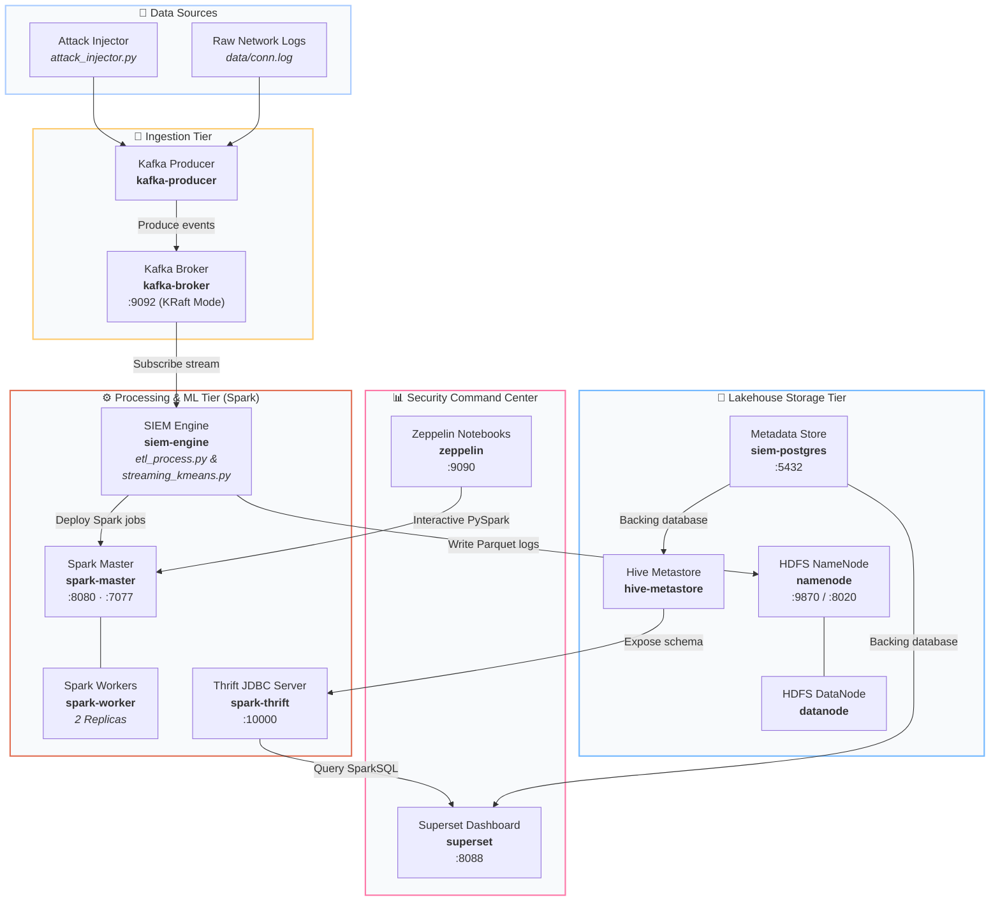
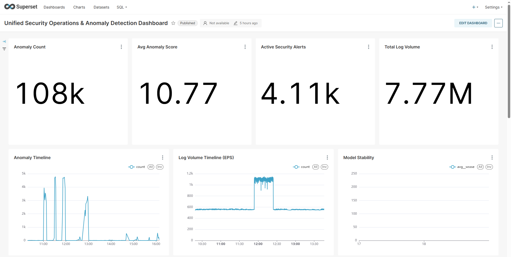

# Apache Lakehouse SIEM Anomaly Detection System 🛡️

### 🛡️ Cybersecurity Anomaly Detection System
A state-of-the-art **Security Data Lakehouse** and **Network Detection & Response (NDR)** platform. It leverages an unsupervised machine learning (K-Means) clustering engine and real-time rules to analyze, detect, and visualize network anomalies at scale.

Built entirely on a modern **Apache Lakehouse Architecture** to deliver real-time data flows, distributed indexing, and long-term forensic persistence.

<div style="display: flex; gap: 8px; flex-wrap: wrap; margin-top: 15px; margin-bottom: 25px;">
  <span style="background: #e65100; color: white; padding: 5px 12px; border-radius: 6px; font-size: 0.9rem; font-weight: bold;">Spark Streaming</span>
  <span style="background: #231f20; color: white; padding: 5px 12px; border-radius: 6px; font-size: 0.9rem; font-weight: bold;">Kafka KRaft</span>
  <span style="background: #fbc02d; color: #333; padding: 5px 12px; border-radius: 6px; font-size: 0.9rem; font-weight: bold;">Hadoop HDFS</span>
  <span style="background: #fdd835; color: #333; padding: 5px 12px; border-radius: 6px; font-size: 0.9rem; font-weight: bold;">Apache Hive</span>
  <span style="background: #0088cc; color: white; padding: 5px 12px; border-radius: 6px; font-size: 0.9rem; font-weight: bold;">Zeppelin</span>
  <span style="background: #00a699; color: white; padding: 5px 12px; border-radius: 6px; font-size: 0.9rem; font-weight: bold;">Superset</span>
</div>

---

## 🏗️ Platform Architecture

The platform implements a modern Lambda/Lakehouse architecture, guaranteeing sub-second ingestion, real-time machine learning scoring, and multi-year forensic log retention:



### 📊 Real-Time SOC Anomaly Dashboard Preview


---

## 🌟 Core Components & Capabilities

### 1. Ingestion Layer (Apache Kafka)
* **KRaft Mode Broker:** Operates without ZooKeeper dependencies for streamlined administrative control and sub-millisecond message delivery.
* **High-Speed Log Producer:** Multi-threaded ingestion engine capable of reading real-world datasets (like Zeek captures or UNSW-NB15) or dynamically generating high-fidelity synthetic event streams.

### 2. Processing & ML Engine (Apache Spark & PySpark)
* **Real-time ETL (`etl_process.py`):** Automatically consumes raw JSON/TSV streams from Kafka, parses unstructured event payloads into standardized SQL schemas, enriches geo-location metadata, and sinks files into HDFS in optimized `.parquet` format.
* **Streaming K-Means Anomaly Detector (`streaming_kmeans.py`):** A machine learning pipeline that scales numerical network features (such as duration, bytes, and packet counts) in real-time, trains an online clustering model, and scores incoming connections. Points lying outside normal cluster radii are flagged as anomalies with computed threat scores.

### 3. Forensic Storage Layer (HDFS & Apache Hive)
* **Distributed HDFS Lakehouse:** Storage optimized for massive log archives utilizing standard Write-Once-Read-Many (WORM) parameters to secure threat logs against tamper attempts.
* **Hive Metastore & Catalog:** Schema-on-read catalog using PostgreSQL backend database metadata, exposing database views for interactive SQL analysis across external processing nodes.

### 4. Analysis & SOC Visualization Layer
* **Apache Superset (SOC Dashboard):** The analysts' control center. Tracks active anomaly trends, alerts, geographical source-destination flow maps, and key-performance SIEM metrics in real-time.
* **Apache Zeppelin (Threat Hunting Lab):** Collaboratively design and test forensic queries, refine the K-Means clustering hyperparameters, and run deep-dives against multi-terabyte HDFS historical stores using PySpark and SparkSQL.

---

## 🔌 Unified Port Mapping & Service Endpoints

The entire platform orchestrates 13 docker containers, communicating over a dedicated virtual network. Below are the exposed endpoints for monitoring, visualization, and forensic investigation:

| Service | Port | Endpoint URL | Purpose / Operational Focus |
| :--- | :---: | :--- | :--- |
| **Spark Master UI** | `8080` | [http://localhost:8080](http://localhost:8080) | Spark cluster state, active streaming applications, and executor logs |
| **Apache Superset** | `8088` | [http://localhost:8088](http://localhost:8088) | Real-time SOC Security Anomaly Dashboard & Alert feeds |
| **Apache Zeppelin** | `9090` | [http://localhost:9090](http://localhost:9090) | Forensic Cyber Research Lab, threat hunting notebooks, and model tuning |
| **HDFS NameNode** | `9870` | [http://localhost:9870](http://localhost:9870) | HDFS Data Lake health dashboard and distributed file explorer |
| **Spark Thrift Server** | `10000` | `jdbc:hive2://localhost:10000` | JDBC/ODBC connector mapping SparkSQL to Superset SQL Lab |
| **Kafka Broker** | `9092` | `PLAINTEXT://localhost:9092` | Real-time security message hub and ingestion endpoint |

---

## 🚀 Quick Deployment & Operational Launch

### 1. Prerequisites
Ensure you have Docker and Docker Compose (v2.0+) installed on your machine. For local testing, assign at least 8 GB of RAM to your Docker daemon.

### 2. Startup Stack
Clone the repository and spin up the complete data lakehouse stack using a single orchestrated command:

```powershell
docker compose up -d --build
```

Verify that all services are healthy and running:

```powershell
docker compose ps
```

### 3. Simulating Cyber Attacks (Validation Suite)
The platform includes an automated security injection script to test the NDR K-Means anomaly detection capability. Run any of the following command patterns inside the producer context to stream malicious traffic patterns:

```powershell
# Inject all simulated cyber attacks (DDoS, Portscan, C2, Exfiltration)
docker exec kafka-producer python attack_injector.py all

# Inject Port Scan Simulation only
docker exec kafka-producer python attack_injector.py portscan

# Inject Data Exfiltration attempt
docker exec kafka-producer python attack_injector.py exfiltration

# Inject Command & Control (C2) beacon signals
docker exec kafka-producer python attack_injector.py c2
```

Navigate to **Apache Superset** ([http://localhost:8088](http://localhost:8088)) to watch incoming alarms, rising threat maps, and anomalous score distributions trigger in real-time.

---

## 📂 Repository Architecture

* **[`config/`](file:///c:/Users/yusuf/Github/Apache-BigData-SIEM/config)** — Configuration manifests for Hadoop, Hive, Spark, Kafka, PostgreSQL, Superset, and Zeppelin environments.
* **[`data/`](file:///c:/Users/yusuf/Github/Apache-BigData-SIEM/data)** — Reference guidelines and sample integration configurations for massive security logs (includes the [Data Integration Guide](file:///c:/Users/yusuf/Github/Apache-BigData-SIEM/data/README.md)).
* **[`docs/`](file:///c:/Users/yusuf/Github/Apache-BigData-SIEM/docs)** — Comprehensive capacity studies, verification scenarios, example SQL queries, and service-specific blueprints.
* **[`showcase/`](file:///c:/Users/yusuf/Github/Apache-BigData-SIEM/showcase)** — An interactive, media-rich HTML/CSS presentation summarizing the platform for presentations and security defenses.

---
*Built for resilient, petabyte-scale real-time Threat Intel & Defense.*
