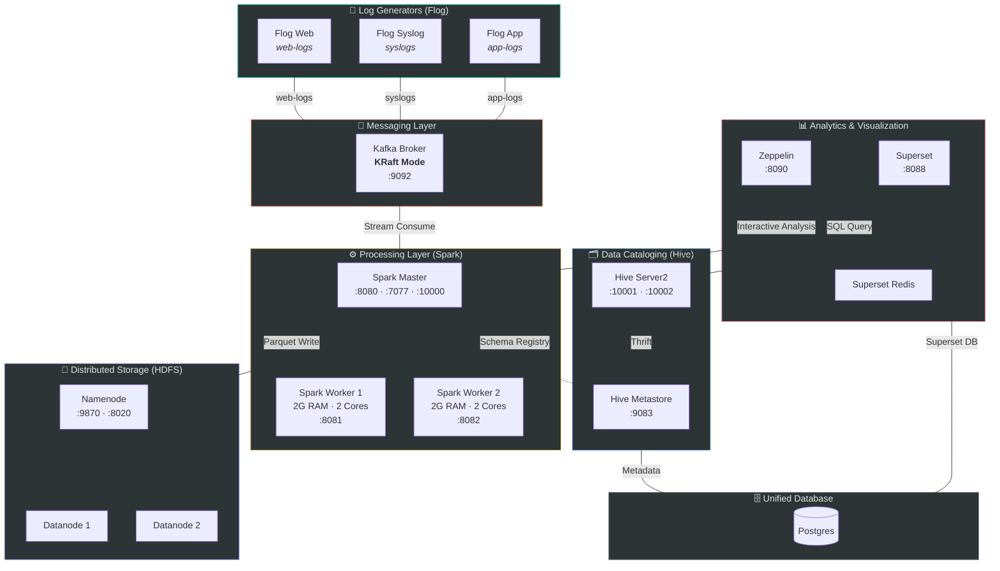

# Apache-BigData-SIEM 🛡️🏛️

[](https://opensource.org/licenses/Apache-2.0)
[](http://makeapullrequest.com)

**Apache-BigData-SIEM** is a high-performance, scalable security analytics platform designed to overcome the volume and cost limitations of traditional SIEM solutions. By leveraging a **Data Lakehouse** architecture, it provides both real-time stream processing and deep historical forensic capabilities.

Please check our [Contributing Guidelines](CONTRIBUTING.md) and [Code of Conduct](CODE_OF_CONDUCT.md) if you wish to help improve this project!

## 🚀 Architectural Overview
The project implements a modern Lakehouse pattern to ensure data is processed instantly and stored in an optimized format for long-term security analysis.

* **Ingestion:** **Apache Kafka** — Distributed message buffer handling high Events Per Second (EPS) bursts.
* **Processing:** **Apache Spark Streaming** — Real-time log parsing (Regex), normalization, and correlation.
* **Cataloging:** **Apache Hive** — Structured SQL interface over unstructured log data in HDFS.
* **Storage:** **Apache Hadoop (HDFS)** — Data Lake backbone, storing logs in **Apache Parquet** format.
* **Visualization:** **Apache Superset** & **Apache Zeppelin** — Dashboards, analytics, and interactive notebooks.

### Platform Architecture Diagram

<!-- ARCHITECTURE_DIAGRAM_START -->

<!-- ARCHITECTURE_DIAGRAM_END -->

## 💡 Key Features
- **Real-time Threat Detection:** Immediate anomaly detection and alerting using Spark's windowing functions.
- **Advanced Threat Hunting:** High-speed SQL queries over billions of rows using Spark SQL and Hive.
- **Lakehouse Efficiency:** Combines the flexibility of a Data Lake with the structural performance of a Data Warehouse.
- **Cost-Effective Scalability:** Built entirely on the open-source Apache ecosystem, eliminating expensive per-terabyte licensing.

## 🛠️ Technology Stack
- **Messaging:** Apache Kafka
- **Processing Engine:** Apache Spark (PySpark)
- **Data Warehouse:** Apache Hive
- **Distributed Storage:** Apache Hadoop (HDFS)
- **Environment:** Docker & Docker-Compose

## 📂 Quick Start

We provide a simple `Makefile` wrapper for all Docker and Spark commands. If you do not have `make` installed, you can look at the `Makefile` and run the raw `docker compose` and `docker exec` commands.

### 1) Start the Platform

```bash
make up
# or: docker compose up -d
```

This will deploy:

- Kafka (KRaft mode)
- Hadoop HDFS (1 NameNode + 2 DataNodes)
- Hive Metastore + HiveServer2 + PostgreSQL Metastore DB
- Spark (1 Master + 2 Workers)
- 3 distributed flog producers (`web-logs`, `syslogs`, `app-logs`)

### 2) Run the ETL Job

```bash
make run-job
# or: docker exec -it spark-master spark-submit ...
```

### 3) Validate Distributed Health

Use the operational runbook in `docs/verification-guide.md` to verify:

- HDFS DataNode distribution
- Hive connectivity
- Kafka topic flow
- Spark worker registration
- Hive table population from Kafka stream

## 📁 Added Infrastructure Files

- `docker-compose.yml`
- `config/hadoop/core-site.xml`
- `config/hadoop/hdfs-site.xml`
- `config/hive/hive-site.xml`
- `config/spark/spark-defaults.conf`
- `flog/Dockerfile`
- `flog/publish_flog.sh`
- `jobs/etl_process.py`
- `docs/verification-guide.md`